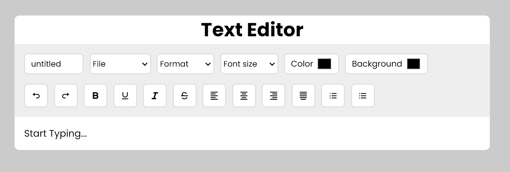

# Text Editor

A simple web-based text editor with formatting options.

## Features

- Create and edit text documents
- Apply formatting to text (e.g., bold, italic, headings)
- Change text color and background color
- Undo and redo text changes
- Create links

## Demo

You can try the Text Editor here: [Live Demo](https://geeekdude.github.io/Text-Editor)

## Getting Started

1. Clone this repository or download the source code.
2. Open the `index.html` file in a web browser to use the Text Editor.

## Usage

- Start typing in the editable area to create and edit text.
- Use the toolbar to format text, change font size, and apply colors.
- Use the "File" dropdown to create a new file or save as a text or PDF file.
- The "Show Code" button allows you to toggle between code view and the visual editor.

## Contributing

If you want to contribute to this project, please follow these steps:

1. Fork the repository.
2. Create a new branch for your feature or bug fix.
3. Make changes and commit them.
4. Submit a pull request.
